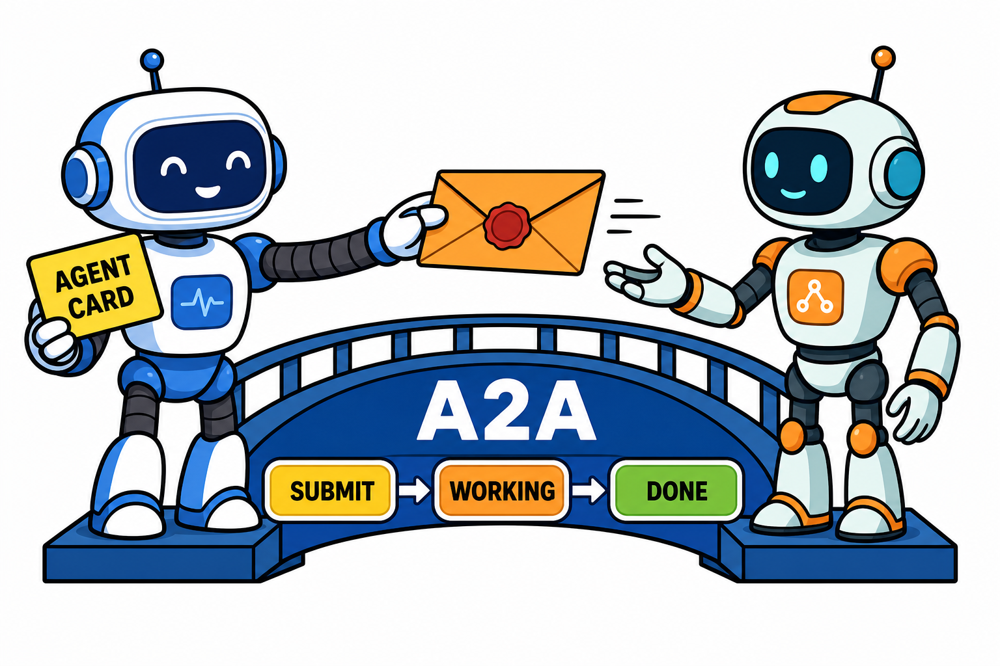

# A2A 协议：当 Agent 需要和 Agent 打交道

MCP 解决了"Agent 怎么用工具"，但很快大家发现另一个问题：Agent 和 Agent 之间怎么对话？你公司的采购 Agent 想跟供应商的报价 Agent 谈事情，双方框架不同、厂商不同，语言不通。A2A 协议就是为这个场景而生的。

## A2A 是什么

A2A（Agent2Agent）是 Google 在 2025 年发起的开放协议，目标是让不同团队、不同框架构建的 Agent 能够互相发现、沟通和协作，后来捐赠给 Linux 基金会以中立身份继续演进，参与企业数量可观。

它定义了几个核心概念：

**Agent Card**：每个 Agent 对外发布的"名片"，一份 JSON 文档，声明自己是谁、有什么技能、支持什么交互方式、鉴权要求是什么。其他 Agent 靠它来发现和评估合作对象。

**任务（Task）**：A2A 交互的基本单位。一个 Agent 向另一个 Agent 提交任务，任务有完整的生命周期状态——已提交、处理中、需要输入、已完成、失败。

**消息与产物（Message / Artifact）**：任务过程中的沟通内容和最终交付物，支持文本、文件、结构化数据等多种形态。

通信基于 HTTP 和 JSON-RPC 等成熟标准，长任务支持流式更新和推送通知，不需要发起方一直挂着连接等结果。

## A2A 和 MCP 是什么关系

这是最容易混淆的点，一句话可以说清：

MCP 管 Agent 与工具的通信（垂直方向），A2A 管 Agent 与 Agent 的通信（水平方向）。

工具是被动的，调用即返回；Agent 是主动的，有自己的推理过程和任务状态，可能中途反问你、可能要跑几个小时。两种交互的复杂度不同，所以需要两套协议。它们是互补而非竞争关系——一个 Agent 完全可以对下用 MCP 调工具，对外用 A2A 跟同伴协作。

## 编辑判断：远景很大，现阶段冷静看

A2A 描绘的图景是"Agent 互联网"：企业间的自动化协作不再靠人肉对接口，而是 Agent 之间自主协商。这个方向的想象空间毋庸置疑。

但当下要保持清醒的判断。

跨组织的 Agent 协作牵扯信任、计费、审计、责任归属这些协议本身无法完全解决的问题。技术标准只是必要条件，商业和法律基础设施还要时间。

目前更现实的落地是企业内部：不同部门、不同技术栈的 Agent 用 A2A 打通，避免内部重复造轮子。这个场景信任问题弱化，价值立竿见影。

多协议并存也是短期常态。除了 A2A，社区还有多种 Agent 通信协议在演进，格局尚未完全收敛。好在这类协议都基于 HTTP 和 JSON 等通用标准，切换成本可控。

## 行动建议

如果你在做多 Agent 系统，现在值得做三件事：

第一，读一遍 A2A 规范里 Agent Card 和任务生命周期的定义，就算暂时不接入，这套抽象对你设计自己的 Agent 接口也有直接参考价值。

第二，内部 Agent 之间的接口尽量向标准协议靠拢，避免自造私有格式，后面切换标准的成本会低很多。

第三，关注你所用 Agent 框架的 A2A 支持进度，主流框架大多已提供或在路线图中。

Agent 之间的互操作是多智能体时代绕不开的一环。A2A 未必是最终答案，但它当前是这个方向上共识度最高的尝试。
