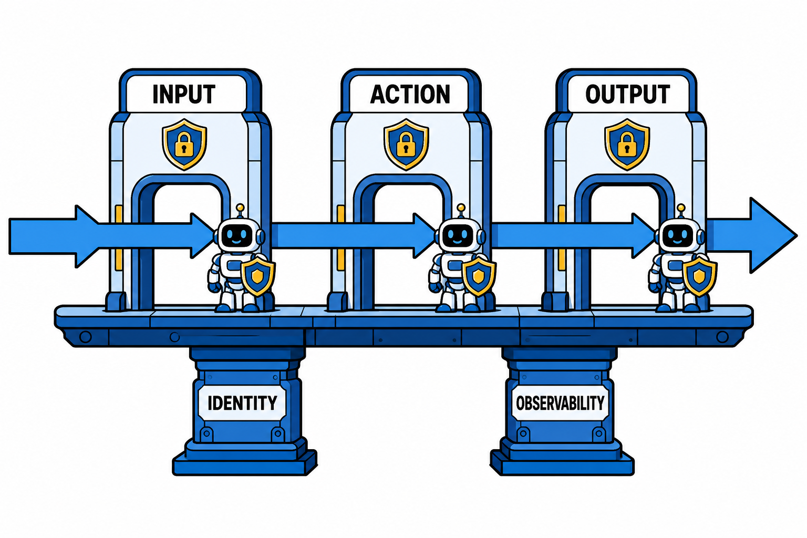

# Agent 安全护栏：给自主 AI 系上安全带的工程指南

聊天机器人说错话，最坏结果是截图挂上社交网络；Agent 做错事，可能是数据被删、邮件被误发、钱被转走。当 AI 从"生成内容"升级到"执行操作"，安全问题的性质彻底变了。护栏（Guardrails）因此成为 Agent 落地讨论中出现频率最高的词之一。

## 风险模型变在哪

传统 LLM 应用的风险集中在内容层面：有害输出、幻觉、偏见。Agent 在此之上叠加了三类新风险：

**行动风险**：Agent 有工具执行权，错误决策会直接改变外部世界，且很多操作不可逆。

**注入风险**：Agent 会主动读取外部内容——网页、邮件、文档。攻击者把恶意指令藏在这些内容里（间接提示注入），就可能劫持 Agent 的行为。这被业内广泛视为 Agent 安全的头号威胁。

**级联风险**：多 Agent 系统里，一个被污染的 Agent 会把错误传给同伴，单点失守变成系统性失守。

## 三层护栏怎么建

成熟的护栏体系通常分三层部署，每层拦截不同的问题。

**输入层**：请求进入 Agent 之前过一道筛。识别越狱尝试、提示注入特征、超出业务范围的请求。对外部内容（检索结果、网页、邮件）做净化处理，标注来源可信度，低可信内容不允许携带指令语义。

**行为层**：这是 Agent 特有、也最关键的一层。核心手段包括——

- 工具白名单：每个 Agent 只能用完成本职任务所需的工具，多一个都不给。
- 参数校验：工具调用的参数过规则检查，比如转账金额上限、可操作的目录范围。
- 高危动作门禁：删除、支付、对外发送、改生产配置，必须人工确认（human-in-the-loop）。
- 预算限制：步数上限、token 上限、执行时长上限，防失控循环。

**输出层**：结果交付前的最后检查。敏感信息（密钥、个人数据）过滤、合规审查、格式校验。输出同时落审计日志，出问题能回溯。

## 配套建设：护栏之外的两件事

**身份与权限**：Agent 应该有独立的机器身份，而不是复用人类员工的账号凭据。权限按最小化原则授予，密钥定期轮换，Agent 之间的调用也要鉴权。"Agent 的身份治理"正在成为企业安全的新议题。

**可观测性**：每个决策、每次工具调用、每条数据流向都要有轨迹记录。没有可观测性的护栏是摆设——你甚至不知道护栏拦住了什么、漏过了什么。

## 编辑判断：护栏不是越多越好

护栏过严的系统同样失败：每步都要人确认的 Agent，不如不用；误拦率高的护栏，用户会想办法绕过，反而制造更大的暗面风险。

务实的做法是按风险分级——只读操作放开跑，可逆写操作记录审计，不可逆高危操作上人工门禁。把确认环节留给真正值得确认的动作。

## 行动建议

如果你的 Agent 已经在跑，本周可以做一次最小安全审计，回答四个问题：它能调用哪些工具，各自最坏能造成什么？它读取的外部内容里，哪些可能被注入？出问题时，你能从日志里还原全过程吗？最坏情况发生时，止损动作是什么？

四个问题里有任何一个答不上来，就先补那一块。

Agent 的自主性和安全性天然存在张力，护栏工程就是在两者之间找平衡点。这个平衡点找得好不好，很大程度上决定了你的 Agent 能不能走出演示环境、进入生产。
