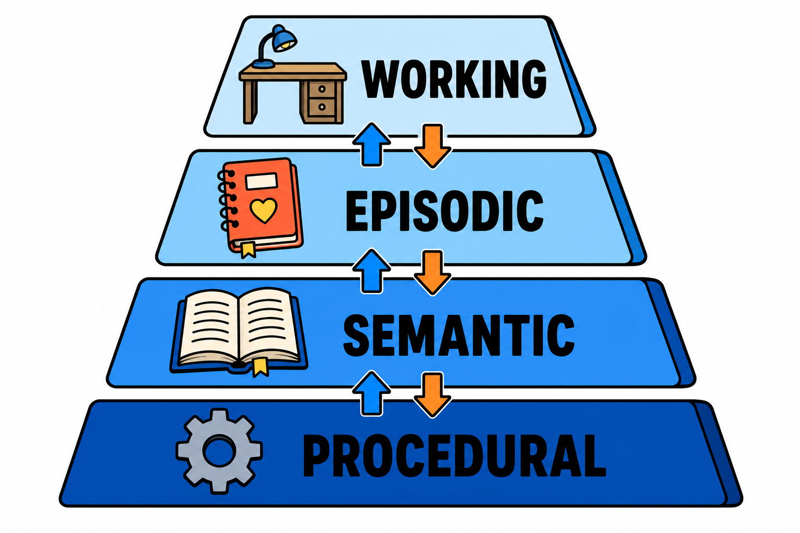

# Agent 记忆机制：让 AI 从金鱼脑变成靠谱同事

用过 Agent 的人都有类似体验：这次会话里教会它的事，下次会话它忘得一干二净；上周踩过的坑，这周原样再踩一遍。记忆机制，就是要解决 Agent 的"金鱼脑"问题——它也是当前 Agent 研究里最活跃的方向之一，被普遍认为是长期自主性的关键瓶颈。

## 上下文窗口不是记忆

一个常见误解：模型上下文窗口越来越大，记忆问题不就自动解决了？

不是。上下文窗口是"工作台"，不是"仓库"。它有三个绕不开的限制：会话结束即清空；塞得越满，模型对中间内容的注意力越差（业内常说的"lost in the middle"）；每次推理都要为整个窗口的内容付 token 成本。

真正的记忆系统，是在上下文窗口之外建一套持久化存储，并决定什么信息在什么时候写入、什么时候取回。写入和取回的策略，才是记忆机制的核心难题。

## 记忆的四种类型

参照认知科学的分类，Agent 记忆通常分为四层：

**工作记忆（Working Memory）**：当前任务的活跃上下文，就是上下文窗口本身。管理手段是压缩和摘要——把冗长的执行轨迹浓缩成要点，腾出空间。

**情景记忆（Episodic Memory）**：具体事件的记录。"上周三用户要求把报告改成周维度""上次调这个 API 超时了三次"。通常以向量检索或结构化日志的形式存储，按相关性召回。

**语义记忆（Semantic Memory）**：沉淀下来的事实和知识。"用户偏好简洁风格""这个项目用 Python 3.12"。这类记忆和具体事件解耦，是从多次交互中提炼出来的稳定结论。

**程序记忆（Procedural Memory）**：怎么做事的经验。"部署这个服务要先跑迁移脚本""这类问题先查日志再重启"。它可以固化为提示词规则，甚至工具调用模板。

成熟的记忆系统是四层协同：情景记忆积累素材，语义和程序记忆从中提炼，工作记忆按需取用。

## 落地的三个常见误区

**什么都存**：把所有对话原文往向量库一塞就叫"有记忆"，结果检索回来一堆噪音，反而污染上下文。存之前先提炼，记忆质量比数量重要得多。

**只写不改**：用户偏好变了、项目配置更新了，旧记忆还在被召回。记忆系统需要更新和遗忘机制——冲突检测、时效标记、定期清理，缺一样都会积累"过期知识"。

**忽视隐私边界**：记忆里往往沉淀着用户的敏感信息。哪些能存、存多久、用户能不能查看和删除，这些问题在设计阶段就要回答，而不是出事后补救。

## 行动建议

如果你在构建 Agent 应用，记忆机制建议渐进式引入。

第一步，先做好会话内的上下文管理——压缩、摘要、关键信息置顶，这一步成本最低、收益立竿见影。

第二步，加跨会话的用户偏好记忆，量小、价值密度高，用户感知最明显。

第三步，才是完整的情景记忆加检索体系，此时配套的提炼、更新、清理机制要同步跟上。

行业里有个说法值得记住：模型能力决定 Agent 的下限，记忆系统决定它的上限。模型迭代你控制不了，记忆系统是你现在就能动手优化的部分。
