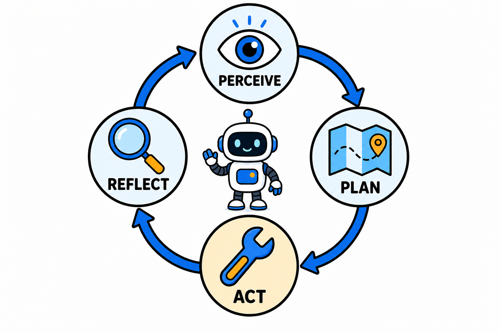

# Agentic AI：从聊天机器人到自主行动，到底变了什么

如果说前两年大家还在讨论"AI 能不能写好一段文案"，现在的话题已经变成"AI 能不能自己把整件事办完"。这个转变背后的关键词，就是 Agentic AI——具备自主行动能力的智能体。

## 从"回答问题"到"完成任务"

传统的生成式 AI 是一问一答：你给提示词，它给内容，交互到此为止。内容质量再高，执行环节仍然全靠人。

Agentic AI 改变的是交互的形态。你给它一个目标，比如"帮我调研竞品定价并整理成表格"，它会自己拆解步骤、调用搜索工具、读取网页、汇总信息，最后交付结果。中间过程不需要你逐步指挥。

一句话概括：生成式 AI 交付内容，Agentic AI 交付结果。

## Agent 的四步循环

主流 Agent 框架的运行逻辑可以抽象成四个环节：

**感知（Perceive）**：接收任务输入和环境信息，包括用户指令、工具返回值、文件内容等。

**规划（Plan）**：把大目标拆成可执行的小步骤。这一步依赖大模型的推理能力，也是 Agent 与简单工作流的分水岭——工作流的步骤是人预先写死的，Agent 的步骤是模型现场推理出来的。

**行动（Act）**：调用工具执行计划，比如搜索、读写文件、调 API、操作浏览器。工具生态越丰富，Agent 的能力边界越大。

**反思（Reflect）**：检查执行结果是否符合预期，不符合就调整计划重试。反思能力的强弱，直接决定 Agent 面对意外情况时是"自愈"还是"跑偏"。

这四步不断循环，直到任务完成或者达到终止条件。

## 为什么是现在爆发

三个条件在最近同时成熟了。

第一，模型推理能力过了临界点。长链条任务规划需要模型稳定地做多步推理，早期模型走三五步就会偏航，现在的旗舰模型可以支撑更长的任务链。

第二，工具调用协议开始标准化。以 MCP 为代表的协议让模型接工具从"每家各写一套"变成"一次接入、处处可用"，生态成本大幅下降。

第三，上下文窗口足够大。Agent 运行过程会积累大量中间信息，窗口不够大时任务做到一半就"失忆"，现在这个瓶颈明显缓解。

## 上手前想清楚三件事

**任务边界**：Agent 适合目标清晰、结果可验证的任务，比如数据整理、代码修改、信息调研。目标模糊、标准主观的任务，Agent 的产出往往需要大量返工。

**失败成本**：Agent 会犯错，这是常态而不是意外。发邮件、改线上配置这类不可逆操作，一定要设置人工确认环节。低风险任务放开跑，高风险任务留门禁，这是目前公认的实践。

**观测手段**：Agent 的执行过程是黑盒的话，出了问题你无从排查。上线前先确认框架能输出完整的执行轨迹——每一步的思考、调用了什么工具、返回了什么。

## 行动建议

如果你还没实际用过 Agent，建议从编程场景切入：Coding Agent 是目前成熟度最高、反馈最直接的方向，任务成功与否一跑便知。

先用现成产品建立体感，再考虑用框架自建。理解了 Agent 的能力边界和失败模式，比急着搭一套自己的系统更重要。

Agentic AI 不是又一个营销词，它代表的是 AI 从"工具"走向"协作者"的实质变化。越早建立正确的使用直觉，越能在这波变化里占到先手。
