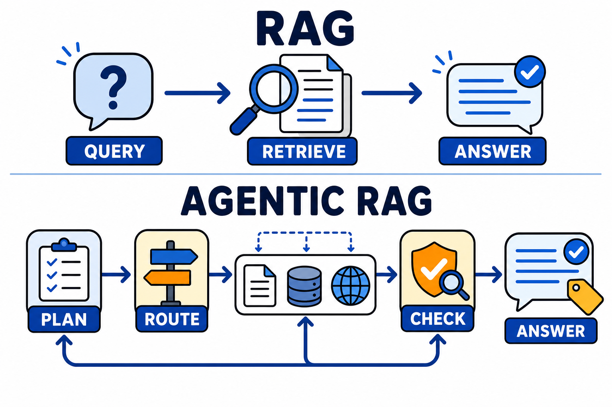

# Agentic RAG：检索增强的下一站，让 AI 自己决定怎么查

RAG（检索增强生成）几乎是企业 AI 应用的标配架构，但用过的团队都知道它的天花板：检索一次、生成一次的固定管道，遇到复杂问题就露怯。Agentic RAG 是当前热度很高的演进方向——把检索的控制权交给 Agent，让它像研究员一样自主决定查什么、去哪查、查到什么程度。

## 传统 RAG 的三个天花板

**一次检索定生死**：用户问题直接拿去检索，命中就命中，没命中就只能靠模型硬编。问题表述和文档措辞稍有偏差，答案质量断崖下跌。

**复杂问题拆不动**："对比 A 方案和 B 方案在成本和性能上的差异"这类问题，需要多次检索、分别汇总。单轮管道只能一锅烩，结果往往顾此失彼。

**不知道自己不知道**：检索结果不相关、不充分时，传统 RAG 照样往下生成，幻觉就是这么来的。

## Agentic RAG 改变了什么

核心变化一句话：检索从"管道里的固定一步"变成"Agent 手里的一件工具"。围绕这个变化，形成了几种关键能力。

**查询规划**：拿到复杂问题先拆解。"对比 A 和 B"被拆成"查 A 的成本""查 A 的性能""查 B 的成本""查 B 的性能"四次定向检索，分头执行再汇总。

**多源路由**：知识不止在向量库里。Agent 根据问题类型决定去哪查——结构化数据走 SQL，实时信息走网页搜索，内部文档走向量检索，精确条款直接读原文。

**自我校验**：每轮检索后评估证据是否充分。不够就改写查询再查，查到矛盾信息就交叉验证。相关研究方向（如 Self-RAG、CRAG 这类工作）都在往这个思路收敛。

**引用可溯**：最终答案的每个关键结论都能指回具体证据片段，方便人工核查。

## 编辑判断：不是所有场景都值得升级

Agentic RAG 的收益和成本都很直白。

收益在复杂问答上：多跳推理、跨源对比、证据要求高的场景，质量提升显著。

成本也不含糊：一次回答从一两次模型调用变成可能十几次，延迟和费用同步上涨；系统从"可预测的管道"变成"有自主性的循环"，调试和评估难度上一个台阶。

所以务实的判断标准是：简单的事实查询、FAQ 场景，传统 RAG 依然是性价比最优解；文档结构复杂、问题天然多跳、错误代价高的场景（法务检索、技术支持、竞品分析），才值得上 Agentic RAG。

## 行动建议

不建议推倒重来，建议渐进升级，每一步都可独立验证收益：

第一步，加查询改写——检索失败时让模型换个表述重试，这是投入最小、见效最快的 Agentic 化改造。

第二步，加检索质量评估——生成前先判断证据够不够，不够就再查，直接压幻觉率。

第三步，才是完整的规划加多源路由，此时记得同步建评估集，否则你无法判断复杂化是否真的带来了质量提升。

RAG 的本质是给模型接上外部知识，Agentic RAG 的本质是让模型学会怎么用好这些知识。前者解决"有没有"，后者解决"查得好不好"——这正是从能用到好用的分界线。
