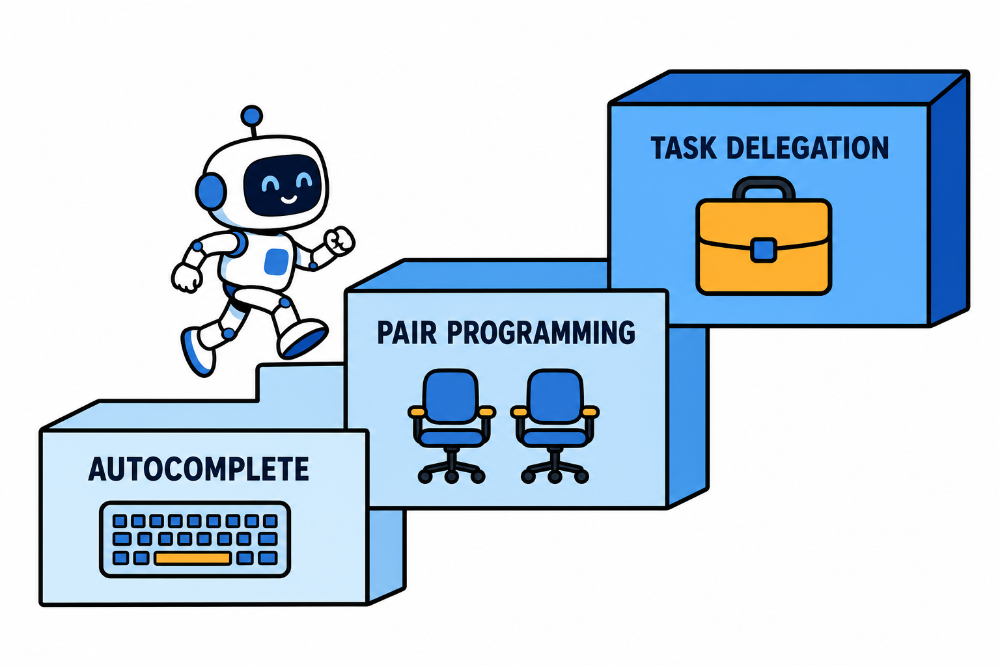

# Coding Agent：从补全代码到独立交付，程序员的工作正在重构

在所有 Agent 落地方向里，Coding Agent 是公认跑得最快的一个。原因不复杂：代码天然可验证——编译通过没有、测试跑绿没有、行为符合预期没有，反馈闭环又快又客观。这让编程成了 Agent 能力进化的最佳试验场。

## 三级演进：补全、结对、委托

AI 编程工具的形态大致经历了三级跳。

**第一级，智能补全**：以早期 Copilot 为代表，按上下文续写代码。人主导，AI 递砖。

**第二级，结对编程**：对话式改代码，AI 能读懂整个仓库，按自然语言指令跨文件修改。人指挥每一步，AI 执行。

**第三级，任务委托**：把一个完整任务交给 Agent——"修掉这个 issue""给这个模块加测试"，它自己读代码、改代码、跑测试、修失败，最后交回一个可审查的变更。人定义目标和验收，AI 负责过程。

当前的行业热点集中在第三级。终端型、IDE 内嵌型、云端异步型的 Coding Agent 产品密集涌现，"给 Agent 派活、人来验收"的工作流开始在真实团队里铺开。

## 真实能力边界：哪些活能放心交

综合社区大量实战反馈，可以给出一个相对稳妥的边界描述。

交得放心的：明确的 bug 修复、格式化与重构、补测试、写文档、样板代码、依赖升级的机械部分。特征是目标清晰、验收标准客观。

要盯着的：跨模块的功能开发、涉及架构决策的改动、性能优化。Agent 能干，但方案未必是你想要的，中途要检查方向。

别指望的：需求本身模糊的探索性开发、需要大量业务背景的决策、对既有系统隐性约定的把握。这些环节人仍然不可替代。

一个被反复验证的规律：任务描述的质量直接决定产出质量。把"优化一下这个页面"换成"把首屏接口的响应时间从 800ms 降到 300ms 以内，可以加缓存但不能改接口契约"，成功率完全是两个量级。

## 团队引入的三个工程动作

**收紧验收而不是放松**：Agent 产出的代码量大、速度快，代码审查成为新瓶颈。测试覆盖、CI 门禁、静态检查这些自动化验收手段，此时比任何时候都值得投入。

**给 Agent 建护栏**：限定它能改的目录、能执行的命令、能访问的环境。沙箱里随便折腾，生产配置碰都别碰。

**沉淀项目上下文**：把项目的架构约定、代码规范、常见陷阱写成 Agent 可读的规则文件（各家工具都支持类似机制）。这份投入一次，每个任务都受益。

## 行动建议

对个人开发者，建议本周就做一件事：挑一个积压已久的小 issue，完整走一遍"描述任务 → Agent 实现 → 审查合并"的流程。亲手验收过一次，你对能力边界的判断会比读任何评测都准。

对技术管理者，值得提前想的问题是：当写代码的边际成本大幅下降，团队的瓶颈会转移到哪里？大概率是需求定义、架构设计和验收标准——这些恰恰是资深工程师的价值所在。

工具在换代，但"清晰地定义问题"这个能力，含金量只会越来越高。
