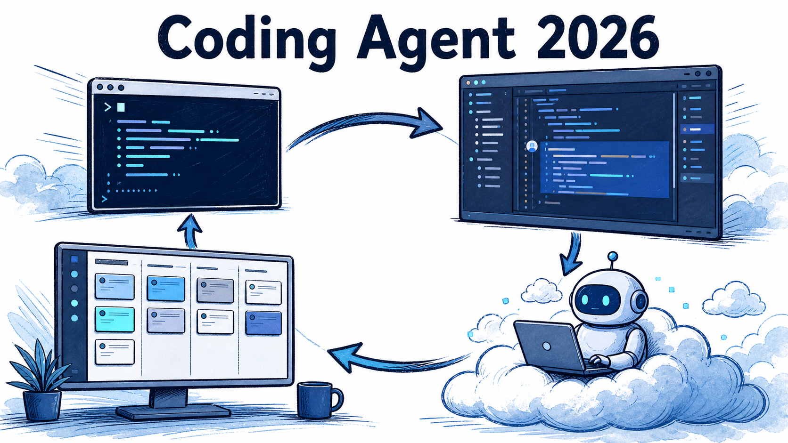
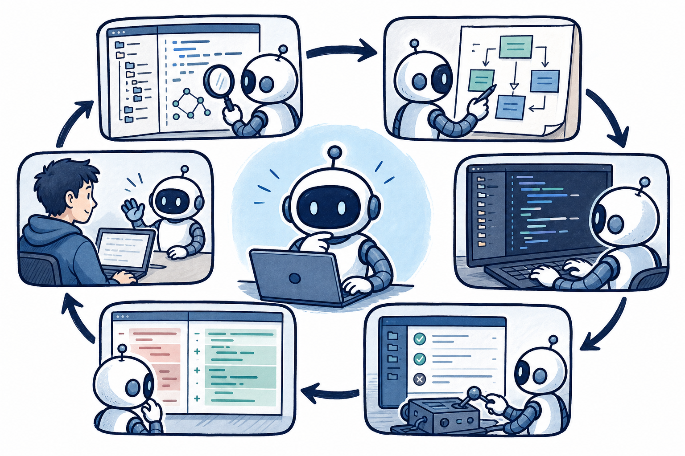
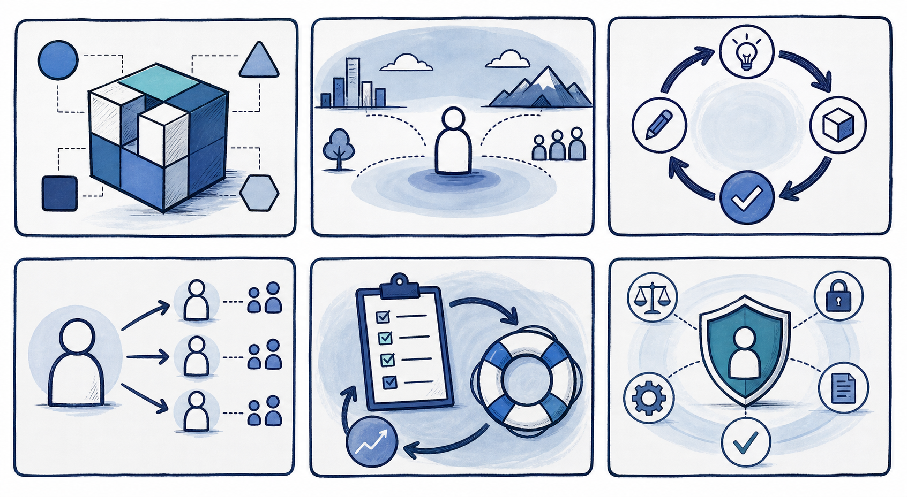
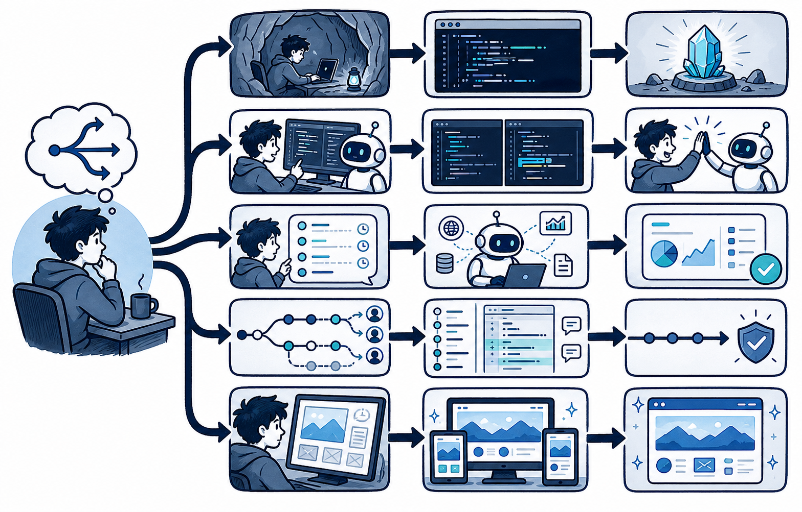

# 2026 Coding Agent 全景对比：从 IDE 助手到可委托的软件工程代理

“AI 会不会替代程序员”的问题，正在被一个更具体的问题取代：哪些软件工程环节，已经可以交给 Agent 完整跑一轮？Coding Agent 的意义不在于多写几行代码，而在于把“理解仓库—规划—编辑—运行命令—验证—交付 diff”连成一个可审查闭环。

这也是为什么它比单纯补全更接近工程协作。代码有编译器、测试、类型系统、CI 和 diff 作为外部反馈；Agent 的建议不必靠语言自证，而可以被真实工具检验。与此同时，长任务、远程环境和自动执行也让权限、数据边界和审查成为选型的一等问题。

本文不做绝对排名，也不比较会快速失效的价格与跑分。以下是截至 2026 年 7 月 29 日，根据官方公开资料能确认的产品形态与能力入口；具体套餐、区域和可用模型应以团队采购前的当日页面为准。

## 先用六个维度，而不是品牌名，理解工具

1. **产品形态**：它是终端 Agent、IDE 内结对助手、桌面任务空间，还是云端异步委托？
2. **仓库理解**：通过本地文件、语义搜索、规则文件、索引、检索或持久知识来获得上下文？
3. **执行闭环**：能否规划、跨文件编辑、运行命令、读取测试输出并迭代？
4. **并行与委托**：是否有子 Agent、多任务或后台异步任务？任务在哪个环境运行？
5. **审查与恢复**：是否能审 diff、保留快照、撤销、分支隔离或交接给人？
6. **扩展与治理**：MCP、Skills、插件、CLI、权限、审计、企业身份和团队协作如何处理？

用这一套问题看产品，会发现“IDE 还是 CLI”只是起点。真正需要匹配的是工作流：任务是否要在本机上下文内快速迭代，是否能离开电脑长时间运行，是否涉及代码外发或联网，以及团队如何接收和审查结果。

## 第一类：终端深度工作，把 Agent 放进既有工程循环

OpenAI Codex、Claude Code、Gemini CLI 等终端形态的共同优点，是与现有 shell、Git、构建、测试和 CI 紧密相连。开发者可让 Agent 在当前仓库中搜索、修改、运行验证，再直接审阅变更；已有 CLI 的退出码和日志也更容易成为可观察证据。OpenAI 的官方资料将 Codex 描述为可在终端、IDE 与云端环境使用的编码 Agent，并强调其本地工作流与可配置批准/沙箱边界。[来源1]

终端并不天然更安全。它通常拥有更接近真实开发环境的能力，因此应给每个项目明确规则：允许改哪些目录、能运行哪些命令、是否允许网络、何时必须停下来请求批准。对于熟悉 Git 和命令行的个人开发者，这类产品的优势是透明：上下文、命令与差异都在同一条工程路径上。

适合场景：修 bug、补测试、读陌生仓库、批量机械重构、与本地工具链高度耦合的任务。风险点：长任务占用本机、环境依赖不稳定、若权限宽松则命令副作用直接落在真实工作树中。

## 第二类：IDE 内结对，把编辑、预览和审查放近

GitHub Copilot、Cursor、TRAE、CodeBuddy、通义灵码等更强调编辑器内体验：选中代码即问、跨文件修改、终端联动、内置 diff 和预览。它们适合需要频繁观察 UI、局部迭代和人机结对的工作；用户不必在“写代码的地方”和“与 Agent 对话的地方”来回切换。

Cursor 的官方文档列出 Agent 的搜索、编辑与终端执行能力，也提供 diff 审查、自动检查点、可恢复快照和命令自动运行/确认配置。[来源2] GitHub Copilot 则天然适配 GitHub 的 PR、Issue、代码审查和组织治理流程；对于已经以 GitHub 为协作中心的团队，集成路径通常比另建平台短。

国内产品应按可访问性、企业网络、模型与本地服务连接、数据合规和团队协作实际验证，而不是按“国内/国外”二分。CodeBuddy 的官方说明将其 Agent 放在 IDE 任务空间中，支持并行任务、产物/文件/变更视图与前端预览。[来源3] 通义灵码与 TRAE 的具体功能迭代很快，采购前应以对应官方文档核对当前版本是否满足代码托管、模型、IDE 与企业权限要求。

适合场景：前端可视化交付、日常结对编程、需要持续人审的多文件改动、团队已有 IDE 习惯。风险点：界面顺滑容易掩盖长链路副作用；每一次“接受全部修改”仍应经过测试与 diff 审查。

## 第三类：任务空间与云端异步委托，把“派活”变成独立交付

当任务需要几十分钟、需要并行探索，或开发者不在电脑旁时，异步 Agent 的价值开始超过即时对话。Codex 的云端任务空间、Cursor Background Agents，以及 Qoder 的 Quest 都属于这一方向：创建任务、让 Agent 在隔离或远程环境执行、跟踪进度、接收产物，再把结果交回审查。

Qoder 当前公开文档把产品分为 Editor 与 Quest：前者服务在流编辑，后者用于长任务委托、任务板、进度和产物审阅；它也提供 MCP、CLI 与自定义 Agent 入口。[来源4] Cursor 的后台 Agent 文档明确说明其在隔离的远程机器中运行、可克隆 GitHub 仓库并使用独立分支，同时提醒自动运行命令和联网环境会扩大提示注入与数据外流风险。[来源5]

这类产品的关键问题不是“能跑多久”，而是执行环境：代码是否会被上传到远程环境？依赖和密钥如何提供？网络是否开放？分支和 PR 如何交接？失败后能否保留日志和工作现场？若这些答案不清楚，就不要把包含生产凭据、敏感代码或不可逆部署的任务交给后台 Agent。

## GUI Agent 与 Agentic RAG：两种补足能力，而非独立选型

Coding Agent 有时必须操作只有网页界面的发布后台、遗留系统或可视化控制台。GUI/Computer Use 能以视觉、DOM 或无障碍树来点击和输入，但界面改版、弹窗、验证码与长路径会累积失败率。它适合作为受隔离、可回滚、需要人工确认的补充能力，不应成为核心生产变更的唯一通道。

同样，仓库和文档检索也不应只理解为“向量库”。Agentic RAG 让 Agent 根据问题决定是否检索、查哪里、证据是否充分、是否改写查询再查。对跨仓库、规范、Issue、内部文档和外部资料的复杂问题，它能提高上下文质量；对简单 FAQ 或确定文件定位，固定检索管道通常更快、更便宜。无论哪种，证据都应在进入模型前过滤、分级并保留出处。

## 场景化建议：把选择落到你的交付方式

- **终端深度工作**：已有成熟 CLI、测试与 Git 流程，优先终端 Agent；把规则与权限放在仓库附近。
- **IDE 内结对**：需要边改边看、频繁小步反馈或前端预览，优先 IDE Agent，并坚持逐次审 diff。
- **长任务委托**：需求与验收较明确、可在隔离环境运行，选择有任务状态、产物和分支交接的异步 Agent。
- **国内网络与本地服务**：优先实测账号、企业网络、模型可用性、私有服务/MCP 连接和数据边界，不根据宣传页替代验收。
- **企业 GitHub 流程**：优先能接入 Issue、PR、代码审查、身份与审计的工具；Agent 的输出应自然落入既有门禁。
- **前端可视化交付**：IDE 预览、截图、浏览器自动化和可恢复快照比“多会写代码”更影响实际效率。

最后的行动建议：先选一个积压但可验收的小任务，要求 Agent 交付计划、变更、测试命令与风险说明；人只在关键点审查。跑完三到五次后，再决定是扩大权限、接入 MCP、引入后台委托，还是停在更简单的结对模式。真正可规模化的不是某个 Agent 的演示能力，而是团队能否把需求、环境、测试、审查和回滚一起变成稳定的交付系统。

## 来源

- [来源1] OpenAI，《Codex》：https://openai.com/codex/
- [来源2] Cursor，《Agent overview》：https://docs.cursor.com/en/agent/overview
- [来源3] 腾讯 CodeBuddy，《Agents Quickstart》：https://www.codebuddy.ai/docs/ide/User-guide/Agent-Mode/Quickstart
- [来源4] Qoder，《Introduction》：https://docs.qoder.com/
- [来源5] Cursor，《Background Agents》：https://docs.cursor.com/background-agent
