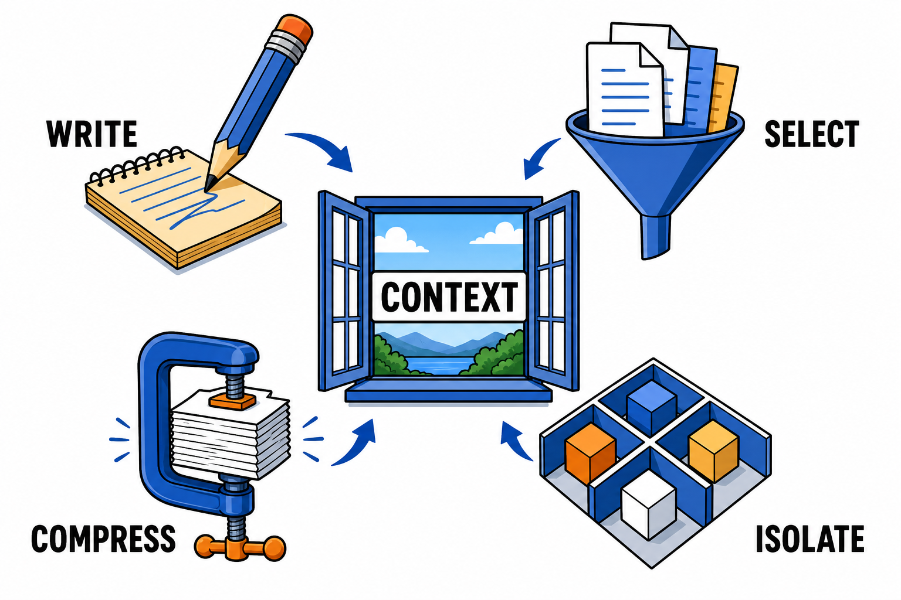

# 上下文工程：提示词工程之后，Agent 时代的核心手艺

"提示词工程"火了两年之后，业内的讨论重心明显转向了一个更大的概念：上下文工程（Context Engineering）。不少一线工程师直言，构建 Agent 的日常工作里，大部分时间其实都花在管理上下文上。

## 从一句话到一个系统

提示词工程关注的是"怎么问"：措辞、格式、few-shot 示例。这在单轮对话时代够用。

Agent 时代的问题变了。一个运行中的 Agent，上下文窗口里同时装着：系统指令、工具定义、用户请求、检索到的文档、历史对话、执行轨迹、中间结果。这些内容动态变化、互相竞争空间，模型的表现直接取决于这一窗口内容的质量。

上下文工程因此被定义为：在正确的时机，把正确的信息以正确的形式装进上下文窗口的系统性方法。它不是写一句好提示词，而是设计一条信息的供给流水线。

一个高频引用的类比：模型是 CPU，上下文窗口是内存，上下文工程就是操作系统的内存管理。

## 四类核心操作

业内对上下文工程的操作已有相对清晰的归纳，常见框架是四个动词：

**写入（Write）**：把窗口外的信息持久化，供后续使用。比如把任务计划写进草稿区（scratchpad）、把重要结论存入记忆系统，避免"想到过但忘了"。

**选择（Select）**：从海量候选中挑出当前步骤真正需要的内容。RAG 检索、记忆召回、按需加载工具定义都属于这一类。选择的准确率决定上下文的信噪比。

**压缩（Compress）**：把长内容变短而不失关键信息。执行轨迹摘要、对话历史滚动压缩、文档要点提取。长任务能不能撑到最后，基本取决于压缩策略。

**隔离（Isolate）**：把不同任务的上下文分开，避免互相污染。多 Agent 架构本质上就是一种上下文隔离手段——每个子 Agent 只看到自己需要的世界。

## 常见的上下文故障

上下文管理不当有几种典型症状，社区总结得很形象：

**中毒（Poisoning）**：错误信息进入上下文后被反复引用，越错越深。

**分心（Distraction）**：无关内容太多，模型抓不住重点，指令遵循度下降。

**冲突（Clash)**：上下文里存在互相矛盾的信息或指令，模型行为变得不可预测。

这些故障的共同解法：宁缺毋滥。上下文里的每一段内容都应该回答"它对当前步骤有什么用"。

## 可直接套用的实践清单

- 系统指令分层：稳定不变的规则放最前面，任务相关的动态内容靠后放。
- 工具按需暴露：不要一次性给模型全部工具，按任务阶段筛选。
- 执行轨迹定期压缩：设一个阈值（比如窗口占用过半）触发摘要。
- 关键约束重复强调：长任务中，重要约束在压缩后要重新注入，防止被"摘要掉"。
- 检索结果先过滤再入窗：加一层相关性重排或规则过滤，别让检索器的原始输出直接进上下文。

## 行动建议

上下文工程的入门成本不高：从你现有 Agent 的一次失败案例开始，把当时的完整上下文导出来逐段审视——哪些内容是噪音、哪些关键信息缺失、哪些指令被稀释了。做一次这样的解剖，比读十篇方法论文章更有体感。

模型每年都在换代，但"把对的信息在对的时机给到模型"这门手艺，会长期值钱。
