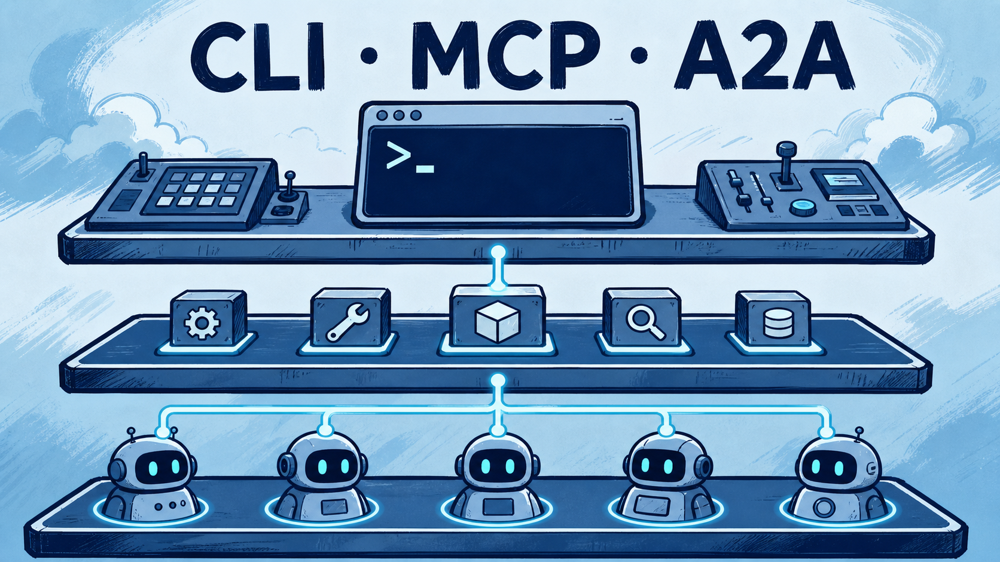
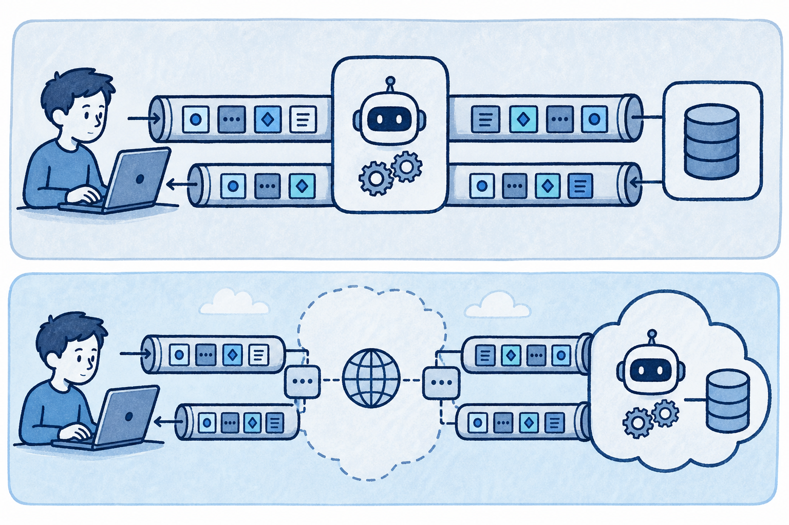
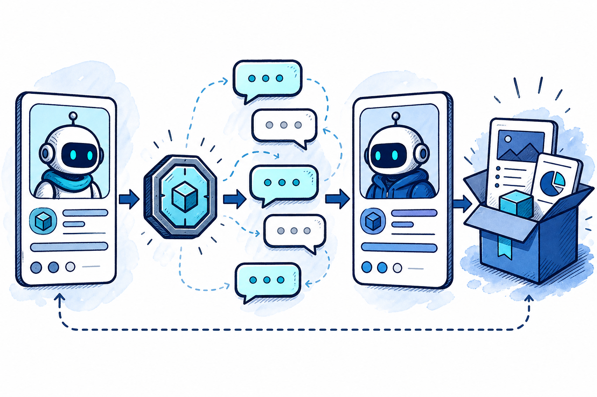
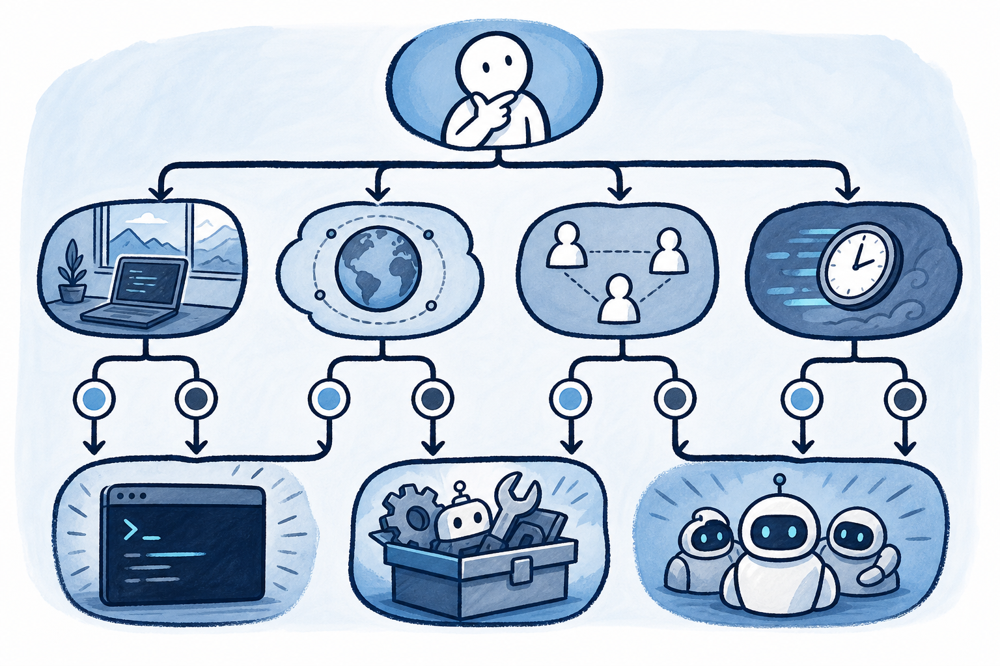

# MCP、A2A 与 CLI：Agent 到底该怎样连接工具和同伴

Agent 能否“干活”，很大程度取决于它怎样离开聊天窗口：运行命令、读写数据、调用内部服务，或者把一个长任务交给另一个 Agent。今天最容易混淆的三个名词是 CLI、MCP 与 A2A。它们不是竞争产品，而是面向不同对象和边界的连接方式。

先给结论：**调用成熟本地命令，优先考虑 CLI；连接需要发现和复用的工具服务，考虑 MCP；委托一个有能力声明、任务状态和交付物的远程 Agent，考虑 A2A。** 三者可以互相封装，真正的选择依据是契约、权限、生命周期和运维成本。

## MCP：让 Agent 应用连接工具与上下文

MCP（Model Context Protocol）解决的是“许多 Agent 应用如何接入许多外部能力”的集成问题。没有统一契约时，每个 IDE、桌面客户端或框架都要分别对接 Git、数据库、文档和内部系统；工具提供方也要为不同客户端重写适配。MCP 把双方分成客户端与服务器：应用实现客户端，能力方实现服务器，再通过同一协议组合。[来源1]

它常见的三类暴露能力是：

- **Tools**：可被调用的动作，例如查询、创建、转换或触发一个受控副作用；
- **Resources**：可读取的上下文数据，通常用 URI 标识，例如文档、文件或业务对象；
- **Prompts**：由服务器提供的可复用提示模板，帮助客户端按约定组织输入。

消息层使用 JSON-RPC，重点不只是“能发 JSON”，而是能力发现、输入 schema、错误结果与会话协商都有可预测的形状。对客户端来说，这意味着一次实现可接入多个服务器；对内部平台团队来说，意味着可把稳定 API 封装成多客户端可复用的能力。

## 两种标准传输：本地 stdio 与远程 Streamable HTTP

MCP 当前规范定义两种标准传输。[来源2]

**stdio** 适合本地、按需启动的集成。客户端启动服务器子进程，双方经标准输入和标准输出交换逐行 UTF-8 JSON-RPC 消息。标准错误可写日志，但标准输出绝不能混入普通日志或进度文本，否则协议会被破坏。它的优点是部署简单、权限跟随本机进程、调试路径短；缺点是生命周期与升级由客户端承担，天然不适合多个独立客户端共享一个长期服务。

**Streamable HTTP** 适合独立部署的服务。服务器可处理多个客户端，以 HTTP POST/GET 提供单一 MCP 端点，并可用 SSE 流式传递多条服务端消息。它更适合统一鉴权、服务治理、远程部署和观测，但也必须承担 Origin 校验、认证、会话、限流与网络故障处理等责任。把一个本地脚本“HTTP 化”并不会自动提高可靠性；它只是在需要共享和远程访问时给出了正确的承载方式。

## MCP 的收益，以及它真实的代价

MCP 的收益很直观：统一契约、能力发现、跨客户端复用，以及把遗留系统包成可观察服务的机会。但工程上至少有四笔成本：

1. 工具名称、描述与 schema 会占用上下文；工具越多，模型越容易选错。
2. 远程服务器增加鉴权、版本、会话、超时与可用性链路。
3. 粗粒度工具可能返回大段无关文本，反而污染模型上下文。
4. 外部返回内容可能携带提示注入；“工具结果”不等于可信指令。

因此，工具设计应以窄而清晰的业务动作为单位，给输入输出设 schema、权限和分页，而不是暴露一个“万能 SQL”或“执行任意脚本”的接口。服务端还应把可读、可写与高危能力分开，向用户展示副作用和确认点。

## 为什么 Coding Agent 仍然大量直接使用 CLI

CLI 并没有被 MCP 淘汰。编程环境中已有成熟的 Git、测试、构建、格式化、部署和诊断命令；它们的帮助文本、参数、退出码和标准输出本来就是长期磨合过的可观测接口。Unix 管道还能先筛选、汇总和截断输出，再把必要部分交给模型，避免整个日志进入上下文。

更重要的是，CLI 往往让权限边界更直观：Agent 在哪个仓库、哪个容器、以哪个身份运行什么命令，可以被 shell、沙箱和 CI 直接约束。已有脚本也能同时服务开发者和 CI，不必为了 Agent 再造一层协议。

行动建议不是“CLI 更先进”，而是按对象选择：本地确定性操作、已有成熟命令、单客户端自动化，先复用 CLI；需要跨应用发现、结构化 schema、远程服务或多客户端复用时，使用 MCP；也可以让 MCP 服务内部安全地调用 CLI，或把一个稳定 MCP 工具包装成命令。

## A2A：当被调用方不是工具，而是一个同伴

A2A（Agent2Agent）处理的是另一层：调用对象拥有自己的推理、工具、身份和长任务状态，调用方无需知道其内部实现。A2A 的 Agent Card 是公开的 JSON 元数据，描述身份、能力、技能、服务端点与认证要求；Task 是有唯一 ID 和生命周期的工作单元；Message 用于回合通信；Artifact 则是任务产出的文档、文件或结构化数据。[来源3]

规范使用 HTTP(S) 承载 JSON-RPC；长任务可通过 SSE 获得增量状态，也能用推送通知处理发起方离线的情况。这个模型比“函数调用后立即返回”更适合异步研究、跨团队交付和需要补充输入的工作。

MCP 与 A2A 的边界可这样理解：MCP 中的工具通常是能力提供者，调用者主导流程；A2A 中的远程 Agent 是相对自主的任务承担者。一个采购 Agent 可以通过 MCP 查库存，也可以通过 A2A 把询价委托给供应商侧的报价 Agent。前者重点是工具契约，后者还要处理任务状态、产物、授权、责任和审计。

## 多 Agent 编排不是把工作拆碎

采用 A2A 或内部多 Agent 前，先问三个问题：专业边界是否真实存在？上下文隔离是否能减少错误？并行是否确实缩短关键路径？若答案都是否，单 Agent 加确定性工作流通常更便宜、更易测试。

需要编排时，常见模式包括主管分派、固定流水线和显式图。无论选哪种，都应传递可验证产物而非长篇自由文本；每个阶段定义输入、输出、预算、重试与人工升级路径；为跨系统调用记录关联 ID。多 Agent 的难题与分布式系统相似：错误会传播，链路会变长，权限与可观测性不能事后补。

## 一棵足够实用的选择树

1. **调用对象是什么？** 已有命令或脚本，先选 CLI；可共享的工具/数据服务，评估 MCP；带自主执行和任务生命周期的同伴，评估 A2A。
2. **运行位置在哪里？** 本地短生命周期集成可用 stdio；远程、多客户端、统一鉴权则用 Streamable HTTP 或 A2A 的 HTTP 服务。
3. **是否需要动态发现与 schema？** 需要时 MCP 的收益上升；固定内部脚本不必强行协议化。
4. **是否有副作用？** 无论哪种连接，都要最小权限、参数校验、预算、审计与高危确认。

编辑判断是：协议并不替你完成系统设计。最好的连接层往往很朴素——让 Agent 只看到完成当前目标所需的能力，让人能看清它准备做什么，并让失败停在可恢复、可追责的位置。

## 来源

- [来源1] Model Context Protocol，《Architecture overview》：https://modelcontextprotocol.io/docs/learn/architecture
- [来源2] Model Context Protocol，《Transports》：https://modelcontextprotocol.io/specification/2025-11-25/basic/transports
- [来源3] Agent2Agent Protocol，《Specification》：https://a2a-protocol.org/v0.2.0/specification/
