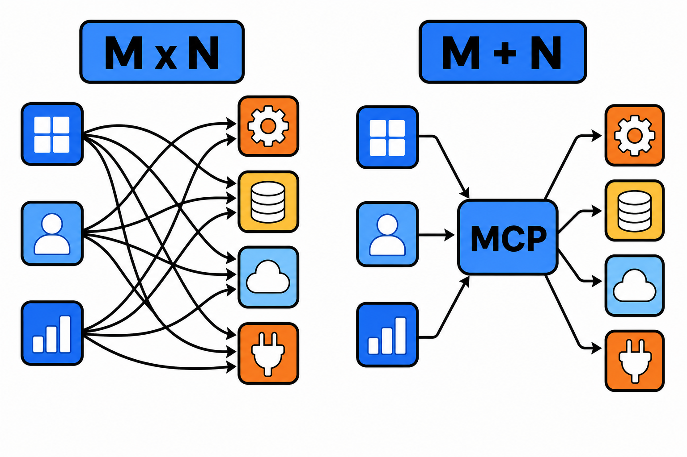

# MCP 协议：AI 世界的 USB-C，为什么人人都在接

过去一年，如果你关注 AI 工具生态，大概率被 MCP 这三个字母刷过屏。编辑器在接、浏览器在接、数据库厂商在接，连设计工具都在接。MCP 到底解决了什么问题，值得整个行业集体转向？

## 先看它解决的痛点：M×N 集成灾难

在 MCP 出现之前，让 AI 模型使用外部工具是一件重复劳动极多的事。

假设有 M 个 AI 应用（聊天客户端、IDE、Agent 框架），N 个外部系统（GitHub、数据库、日历、搜索引擎），每个应用要单独适配每个系统，总共需要 M×N 套集成代码。每套的接口定义、鉴权方式、错误处理都不一样。

MCP（Model Context Protocol）由 Anthropic 于 2024 年底开源，做的事情就是把这个 M×N 问题降为 M+N：应用只需实现一次 MCP 客户端，工具方只需实现一次 MCP 服务器，两边即可自由组合。

这和 USB-C 的逻辑完全一致——统一接口，任意设备互连。这也是它被称为"AI 世界的 USB-C"的原因。

## MCP 提供的三种核心能力

MCP 服务器可以向客户端暴露三类东西：

**工具（Tools）**：模型可以主动调用的函数，比如"查询数据库""创建 issue""发送消息"。这是目前用得最多的能力。

**资源（Resources）**：只读的上下文数据，比如文件内容、API 文档、日志。客户端可以把资源注入模型的上下文。

**提示词（Prompts）**：服务器预置的提示词模板，帮助用户以最佳姿势使用该服务器的能力。

传输层支持本地 stdio 和远程 HTTP 两种方式：本地方式适合个人开发环境，远程方式适合团队共享的服务。

## 生态现状：从个人玩具到企业标配

MCP 生态的增长速度超出了很多人的预期。社区已经沉淀了数以千计的 MCP 服务器，覆盖代码托管、数据库、办公协作、搜索、支付等主流场景。

更关键的信号是主要 AI 厂商的态度：包括 OpenAI、Google 在内的多家头部厂商都已宣布支持 MCP，这让它事实上成为工具接入层的行业标准。对开发者来说，押注 MCP 的生态风险已经很低。

## 编辑判断：接入之前注意三件事

MCP 降低了接入成本，但也带来了新的安全面，这在社区已有大量讨论。

**来源可信度**：MCP 服务器本质是能被模型调用的代码。安装来路不明的服务器，等于给模型开了一扇不受控的门。优先使用官方或知名社区维护的服务器。

**权限最小化**：给数据库类服务器配只读账号，给文件类服务器限定目录范围。模型的行为有不确定性，权限兜底不能省。

**提示注入风险**：如果 MCP 服务器返回的内容里混入了恶意指令（比如网页抓取结果），可能诱导模型执行预期外的操作。处理不可信外部内容时，保持人工审查环节。

## 行动建议

开发者可以从两个方向上手。

用的方向：在你常用的 AI 客户端里配置两三个高频服务器，比如代码托管和搜索，体感马上不一样。

做的方向：官方 SDK 覆盖了 Python 和 TypeScript 等主流语言，写一个最小 MCP 服务器通常只需要几十行代码。把你团队内部的某个 API 包成 MCP 服务器，是理解这套协议最快的方式。

工具接入的标准化是 Agent 时代的基础设施。MCP 现在的位置，很像十年前的 REST API——早点熟悉，不亏。
