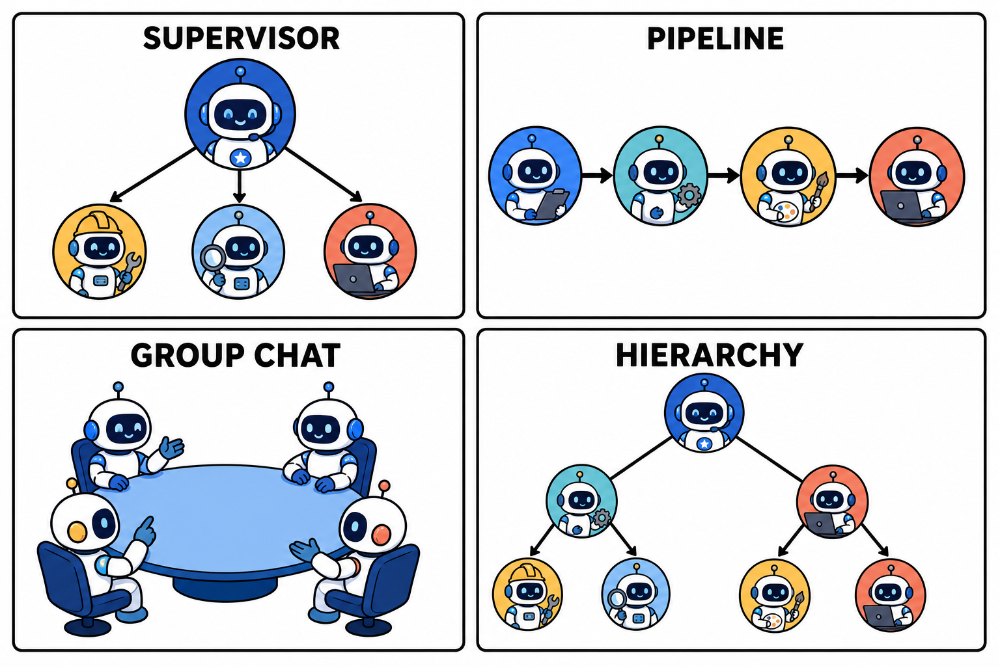

# 多智能体编排：AI 的微服务时刻来了

单体应用拆成微服务的故事，正在 Agent 领域重演。业内不少人把多智能体编排称作 AI 的"微服务时刻"——不是造一个什么都会的超级 Agent，而是让一群专精的 Agent 分工协作。

## 为什么单个 Agent 走不远

全能型 Agent 在任务变复杂后会遇到三堵墙。

**上下文墙**：一个 Agent 包揽所有环节，执行轨迹全部堆进同一个上下文窗口，任务链一长就开始丢信息、忘指令。

**指令墙**：系统提示词里塞进十种角色的行为规范，模型对每一种的遵循度都会下降。让一个 Agent 同时"严谨如审计员"和"发散如创意总监"，结果往往是两头都不像。

**工具墙**：可选工具太多时，模型选错工具的概率随之上升。工具列表本身也在消耗宝贵的上下文空间。

拆分是自然的解法：每个 Agent 只带自己需要的指令和工具，上下文干净，行为可预测。

## 四种主流编排模式

**主管模式（Supervisor）**：一个协调者 Agent 负责理解任务、拆解分派给专家 Agent、汇总结果。结构清晰、可控性强，是目前企业落地最多的模式。代价是主管本身可能成为瓶颈和单点。

**流水线模式（Sequential）**：Agent 按固定顺序接力，前一个的输出是后一个的输入。比如"调研 → 撰写 → 审校"。逻辑简单，适合流程确定的场景，灵活性最低。

**群聊模式（Group Chat）**：多个 Agent 在共享会话里讨论，按发言规则轮流贡献，适合需要多视角碰撞的评审、头脑风暴类任务。发散性强，但收敛速度难以保证。

**层级模式（Hierarchical）**：主管之下还有子主管，形成树状组织。适合超大型任务，复杂度也最高，非必要不上。

主流框架对这些模式的支持已经相当成熟，LangGraph、CrewAI、AutoGen、OpenAI 与 Microsoft 的 Agent SDK 各有侧重，选型时更多看团队技术栈和生态偏好。

## 踩坑经验：分布式系统的老问题一个不少

多智能体系统的工程难点，熟悉分布式系统的人会觉得眼熟。

**错误传播**：上游 Agent 的一个小错误，会被下游放大成离谱的结果。环节之间要设校验点，关键产物过一道验证再往下传。

**成本失控**：Agent 数量翻倍，token 消耗可能翻几倍。上线前先压测成本，给每个任务设 token 预算和步数上限。

**调试地狱**：问题出在哪个 Agent、哪一步？没有完整的执行轨迹追踪，排查基本靠猜。可观测性工具要在第一天就接好，而不是出事后补。

**过度设计**：最常见的坑其实是这个——很多任务一个 Agent 加几个工具就够了，硬拆成五个 Agent 纯属给自己加戏。

## 行动建议

判断要不要上多 Agent，看两个信号：单 Agent 的系统提示词是否已经塞进了多种互相冲突的角色要求；任务是否有天然的阶段边界或专业分工。两个都不满足，先别拆。

要拆的话，从主管模式起步——它最接近人类团队的组织直觉，出问题也最容易定位。先跑通两个 Agent 的最小组合，再逐步加人。

微服务的教训在前：拆分本身不创造价值，合理的边界才创造价值。多智能体同理。
