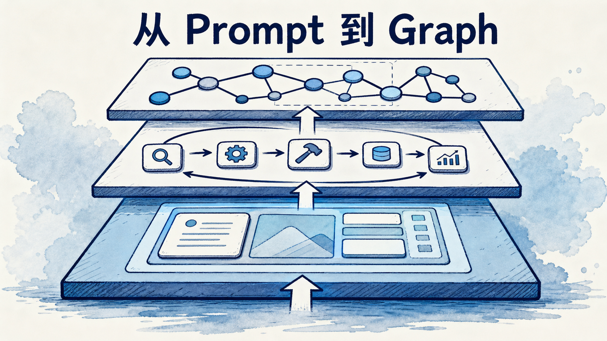
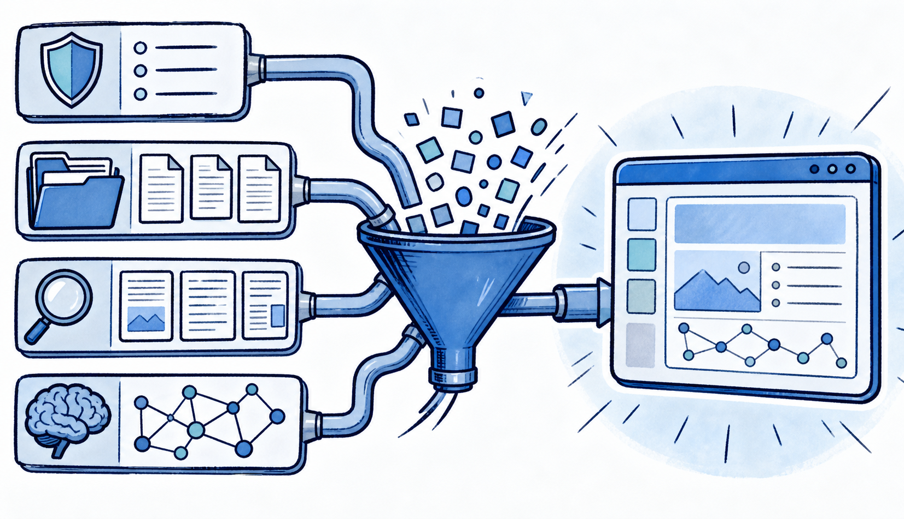
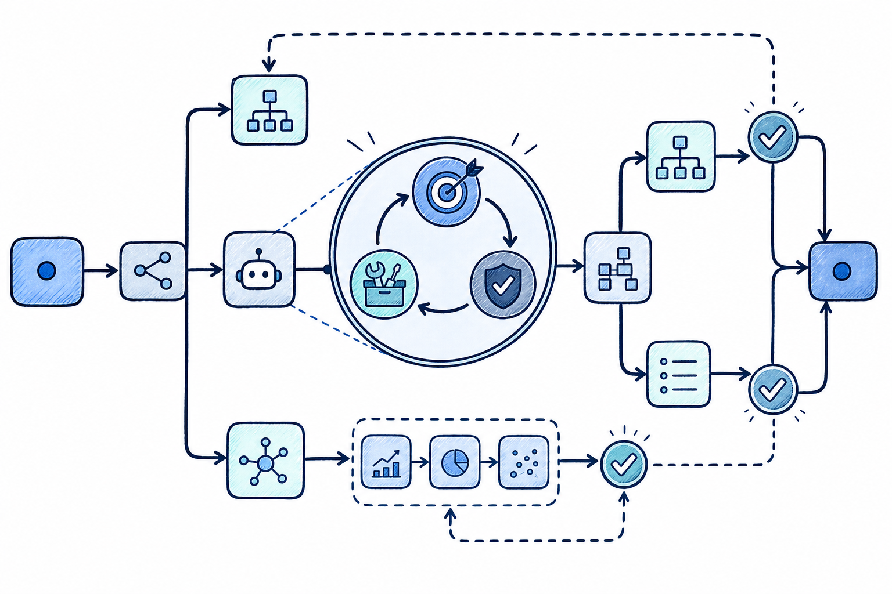
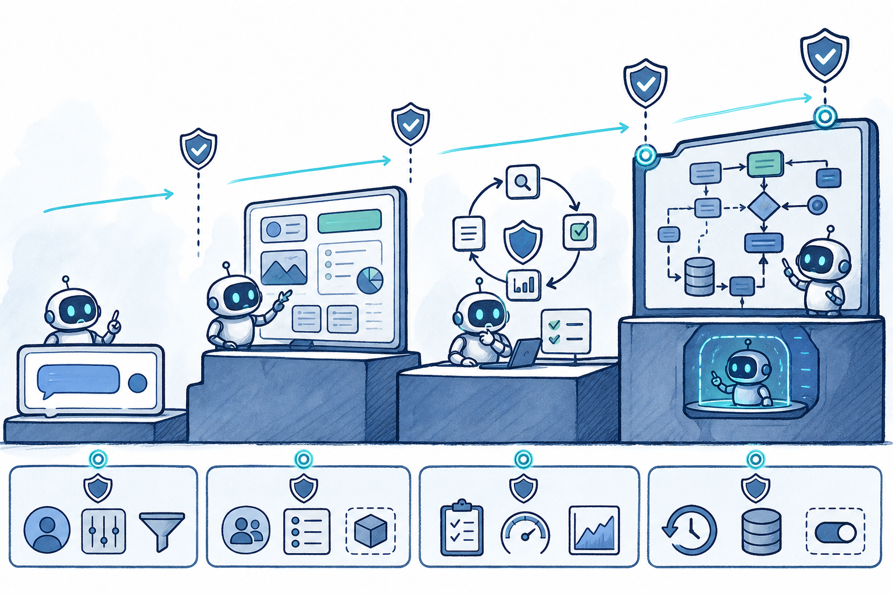

# 从 Prompt 到 Graph：AI Agent 工程正在经历的四次升级

很多团队第一次做 Agent 时，会从一条更长的提示词开始；几周后，提示词旁边出现了检索结果、工具定义、执行记录和用户偏好；再往后，系统开始重试、校验、记账、等待人工批准。到了这里，问题已经不再是“提示词写得够不够好”，而是：这个任务如何被可靠地推进、暂停、恢复和审计。

这不是四次互相取代的技术潮流，而是控制范围逐层扩大的工程升级：**Prompt → Context → Loop → Graph**。理解这条链，能帮我们少走两种极端：把所有复杂性塞进一段神奇提示词，或者一开始就搭出难以维护的多智能体迷宫。

## 第一层：Prompt Engineering，先把一次回答说清楚

Prompt Engineering 解决的是单次模型调用里的指令表达：目标、角色、边界、示例、输入格式与输出约束。它的价值没有消失。无论系统多复杂，最终仍要在某个节点让模型完成“读这份 diff，给出风险清单”或“把这段文档提炼成三个结论”这样的推理。

好的提示词不是修辞比赛，而是减少歧义的接口设计。它应回答：模型要完成什么、可依据什么、不可做什么、结果如何验收。比如让模型“优化代码”几乎不可验收；让它“只修改 `src/auth`，保持公开 API 不变，补充失败路径测试并报告命令输出”才是可执行委托。

但 Prompt 的边界也很明确：它主要描述**这一次调用**。当任务需要查仓库、调用工具、记住上轮选择、判断失败后是否继续时，一条提示词无法独自承担状态管理。

## 第二层：Context Engineering，管理模型此刻真正看见的世界

Context Engineering 关注的不只是“怎么说”，而是“在正确时机，让模型看见什么”。一次 Agent 调用的上下文往往包括系统规则、用户请求、工具 schema、文件片段、检索证据、历史消息、执行摘要和跨轮记忆。它们竞争同一有限注意力与成本预算。

可以把它拆成四个动作：

- **写入**：把计划、关键结论和可复用经验写到窗口外的持久层；
- **选择**：只取当前步骤需要的文件、工具和证据；
- **压缩**：把冗长轨迹变成带出处的摘要，而不是无限拼接历史；
- **隔离**：让研究、编码、审查等互不需要的上下文分开，避免错误指令和噪音串味。

记忆正属于这一层的跨轮机制。工作记忆是本轮活跃窗口；情景记忆记录“上次这个接口超时”；语义记忆沉淀“该项目使用 Java 21”；程序记忆保存“部署前先跑迁移”的做事规则。真正困难的不是“是否接向量库”，而是写入、召回、更新和遗忘规则。什么都存，会把噪音重新灌回上下文；只写不改，会让过期偏好持续误导系统。

这里也应把不可信内容当成数据，而不是指令。网页、邮件、检索片段都可能含有间接提示注入。来源、可信度和允许影响的决策范围，应随内容一起进入上下文。

## 第三层：Loop Engineering，让模型从回答者变成受约束的执行者

Agentic AI 的核心不是“模型会思考”，而是一个可终止的闭环：接收目标，读取状态，选择下一步，调用工具，验证结果，更新状态，然后决定继续、重试、上交人工或停止。

行业中“Loop Engineering”仍是新兴叫法，不是已经标准化的正式学科；但它描述的工程对象很成熟：Agent loop、状态机、重试策略和工作流控制器。它至少应显式拥有以下部分：

1. **目标与成功条件**：例如测试通过、产物存在、人工确认已取得，而不是“看起来完成”。
2. **状态与工具**：每一步读什么、能调什么、工具参数受哪些规则约束。
3. **验证与重试**：失败是网络瞬断、输入不全还是方案错误？对应退避、换策略或停止。
4. **预算与停止**：步数、时间、令牌和外部调用成本必须有限；预算耗尽不是继续“再想一次”。
5. **升级人工**：删除、付款、外发、生产变更等高后果操作，应从自动循环中明确跳出。

一个常被忽略的事实是：循环越自主，验证越重要。模型生成“我已经修好”的文字不等于修好；测试、类型检查、规则校验、人工审阅或下游系统回执，才是让循环收敛的外部证据。

## 第四层：Graph Engineering，把一个循环放进可恢复的流程

当任务出现分支、并行、审批、长等待和跨系统恢复，仅靠一个 while 循环就会变得脆弱。这时需要把执行过程表示为显式图：节点是确定性步骤或 Agent loop，边是路由条件，状态是可持久化的任务事实，检查点是可恢复的位置。

“Graph Engineering”同样是 2026 年仍在形成的行业标签，不应包装成已有统一教材的学科。它的可靠性来自工作流图、状态机、任务队列和编排系统这些成熟实现：

- 一个“研究”节点可内部运行多轮工具循环；
- 研究结果通过边进入“起草”与“事实核验”两个并行节点；
- 高风险写操作先到审批节点，批准后才允许继续；
- 某节点失败时，图能从最近检查点恢复，而不是把整个长任务从头重跑；
- 每条边都可记录谁做了什么、依据何在、花了多少预算。

这也解释了为什么多 Agent 不应是默认答案。多个 Agent 只是图中的一种节点组织方式，适合任务天然有专业边界、上下文必须隔离或并行收益明显的情况。若单 Agent 加少量确定性步骤已经能稳定完成，拆成“主管—专家—复核员”只会增加消息传递、成本和排障面。

## 护栏不是流程末尾的一道过滤器

安全护栏贯穿四层：Prompt 中声明禁止事项；Context 中标记不可信数据；Loop 中限制工具、参数、预算与重试；Graph 中为高风险边设置人工门禁、审计和回滚点。只在最终输出阶段扫描敏感词，无法阻止错误的工具调用。

一个实用的风险分层是：只读查询可自动完成；可逆写入应记录审计并支持撤销；不可逆或高影响动作必须确认。Agent 应使用独立的机器身份和最小权限，不复用人的全权限凭据。这样即使模型被误导，系统也仍有权限边界与止损路径。

## 从简单开始的升级阶梯

不要因为“Graph”听起来先进，就先做一张复杂流程图。更稳妥的升级顺序是：

1. **单轮问答**：目标清楚、无外部副作用，先把提示词和输出 schema 写好。
2. **带上下文的助手**：只在确有必要时加入检索、文件片段、摘要和少量偏好记忆。
3. **可验证循环**：工具调用会失败、目标能客观验收时，再引入状态、验证、预算和重试。
4. **显式执行图**：存在分支、并行、审批、长任务恢复或多个责任边界时，才把节点与边建模出来。

编辑判断是：生产 Agent 的差异，不在于能否多调用几次模型，而在于失败时系统是否仍能解释发生了什么、阻止不该发生的事，并从正确位置继续。Prompt 仍在图的节点里，Context 仍供给每一轮，Loop 仍驱动节点内部；Graph 只是把这些能力放进了可观察、可恢复、可治理的骨架。

## 来源

- [来源1] Anthropic，《Building effective agents》：https://www.anthropic.com/engineering/building-effective-agents
- [来源2] OpenAI，《A practical guide to building agents》：https://openai.com/business/guides-and-resources/a-practical-guide-to-building-agents/
- [来源3] OWASP，《Top 10 for LLM Applications 2025》：https://genai.owasp.org/llmrisk/llm01-prompt-injection/
